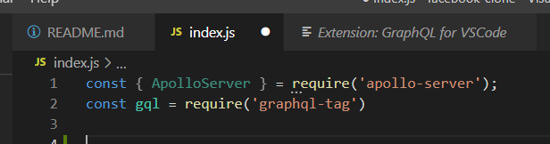
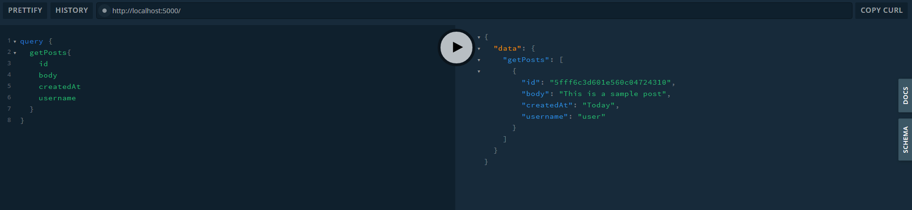

# facebook-clone
building a Facebook clone (kind of )

Technologies Used:
React - used to make responsive pages that "react" in real time to changes on the pages.
Semantic UI - Easy to use pre-built css framework that helps make building beautiful websites, easier.
GraphQL - A query language that can be used on top of any backend. There are 3 types of graphQl operations that we can perform: queries (fetching data), mutations(writing data creating, updating and deleting) and then subscriptions that listen to changes in data in real time.

Graph ql is self -documenting

Other: MongoDB (Atlas)
    Express
    Node.js

To start: 
0.1 Make sure you have a a cluster database set-up in the mongodb cloud website.
1. In the terminal, npm init -y -this should create a package.json
2. you will need to create a index.js and a .gitignore
3. Install dependencies: npm install apollo-server graphql mongoose
4. require ApolloServer and grahpql-tag in index.js  -in order to get syntax highlighting for graphql it's a good idea to install GraphQL for VSCode made by Kumar Harsh. 

5. Create typeDefs

6. set up resolvers, which will take in the graphql logic.
7. set up new apollo server. 
8. start a server and specify a port

9. Type in node index to see your progress! :) Press play to see your database working
10. Require mongoose, our ORM library. in the index.js next to where gql and apollo server are working
11. The connect using mongoose by going to mongodb atlas dashboard, go to 'connect' grab your connection string 
- create config.js file and make a module.exports = { with your connection string here} and then make sure to gitignore your config file so one can see your password

mongodb+srv://rkelm:<password>@cluster0.o9vz6.mongodb.net/<dbname>?retryWrites=true&w=majority
12. rebuild index.js so it connects the localhost AND the database

13. Create models folders - create user.js model, post.js model
14. create a  query for fetching all the posts from the database - use a dummy post to check your work in the mongdb collections section - make sure you have one called "posts"

15. Adust query and resolvers to try to get posts, using try so that if it doesn't work, the entire server won't crash

...if you opne it up in local host and make sure your left side looks like this and hit play you should get something like this:

16. Clean up folders/files by creating graphql folder that holds the typedefs and a resolvers folder which containes two seperate files for resolvers (for users and posts) -also include that in the index - you can now remove const Post = require('./models/Post') from the index.js and replace it with const resolvers = require('./graphql/resolvers')
17. install nodemon - by running npm i -D nodemon and changing the scripts in package.json from tests to "start" : "nodemon index" - don't forget to save and check that it's working

Creating a way for users to authenticate:

18. in typeDefs.js add input RegisterInput and type Mutation 

19. Add 
 Mutation: {
        ...usersResolvers.Mutation
    } 

    to the index module exports in the resolvers folder 
20. Build out the users file in the resolvers - some of it will just be pseudocoded for now
21. npm install bcryptjs jsonwebtoken now that those are installed we can de structure from the args section of information that the user gave us - don't forget to import bcrypt
22. create new user object, save user info to database, create new token (with payloads), and create a special secret (hidden in our config.js file)

23. In order to test and make sure it's working, in your browser make sure it looks like this:

24. The next step is to make suer we don't create two users with the same username, in order to do this we can use specific errors from apollo

25. Now, time for validation -create a util folder containing validators.js create validators for if username, if email, if password - then export it to the users resolvers file. Make sure you de-structure it and then call this function: 
 const {valid, errors } = validateRegisterInput(
                username, 
                email, 
                password, 
                confirmPassword
                 )
            if(!valid){
                throw new UserInputError('Errors', {errors});
            }
26. next we will add a log in - make sure you have a seperate validation for log in in the validators file. Then in the typDefs under type Mutation add login as a type of mutation with a username string and a password string. we need to validate similarly to the way we validated for the user create. 
<!-- https://www.youtube.com/watch?v=n1mdAPFq2Os att authenticatio middleware and create/deleteposts 1:12:52 -->
27. Add post query and mutation to typedefs. This will allow us to look up posts and to create new posts.
28. in typedefs, create  deletePost(postId: ID!): String! mutation in typedefs -deleting is mutating. Then you want to add the corelating resolvers to posts.js Make sure to include the same function name in the typedefs and instances if it does not work (throw and catch errors).
29. Check to so if it is working by going to your browser and entering in:
{
  getPost(postId:"5fff6c3d601e560c04724310"){
  id
	body
  createdAt
  username    
  }

}
...with the appropriate id number (gotten from your collection on atlas) and make sure when you hit play that no errors are returned
30. Add context argument in for apollo server in index.js and create new util file called check-auth.
31. by requiring check-auth and calling  const user = checkAuth(context); in the mutation section of posts, this assures someone can't create a post without authorization. Also in the index of the resolvers folder don't forget to add another mutation
32. Then we can create a new a post based off our model and save it. Don't forget to check and see if it actually works. How to check?
Get your user login token in the html route and set to Bearer: 

33. In order to get posts to show the latest version posted add .sort({createdAt: -1}) to the end of find posts in the resolver.
35. At async deletePost function on post resolvers (remember it has already been created in a few other places) and check it in your local host to make sure it works:

36. Adding likes and comments by first adding them to the type post in the typeDefs, and creating a new type comment and a new type Like - you can refer back to the models to see what you need to put in the typeDefs - they should match, with the addition of an id.
37. Then we need to add mutations to create a comment and like a post -make sure they match up with your intentions and that you are returning Post!
38. Next we will create a comments.js file in the resolver folder - then import that new file to your index.js this file will contain a mutation that checks the auth and creates a comment on a new a post. In order to check it make sure your localhost looks similar to the image below. If you get an auth error, you may need to log in again and get a new token. If you continue to get errors check to make sure your file paths are correct and you are requiring things in the right places.

39. Add delete comment function make sure it has errors for if a user tries to delete another persons comment (not 100% neccesary but a good check anyway) aaaand if the post doesn't work check to make sure it worked in the browser. by typing in mutation { deleteComment(postId:""
commentId:"){
    id 
    comments{
        id
        username
        body
    }
}}
and making sure you have auth bearer token correct.
40. Adding likes to the posts: in posts create an async function for likePost -TEST IT IN THE BROWSER!

<!-- STOPPED AT 1:56:58 -->
41. and type Subscription to type defs to get started on how to use subscriptions then in index we need something from apollo-server, called pub sub then we need to create a new instance const pubsub - new PubSub and pass it to the context inside the server context = ({req}) => ({ req, pubsub}) then in posts.js add a function called subscription that only takes in context, no parent and no argument. the context will be 'NEW_POST' we wll also need to add a a pubsub right after a new post is created so that tht person subscribing can see the new post. 
42. In the index.js of the resolvers folder we will need to a new field, Subscription. Check and make sure it works
43. In order to count likes and comments we are going to need to add a few things.