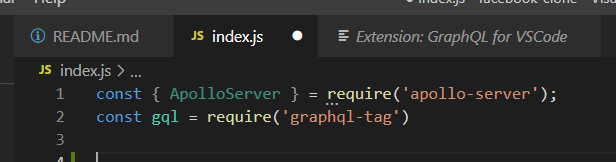
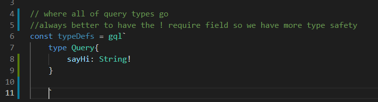
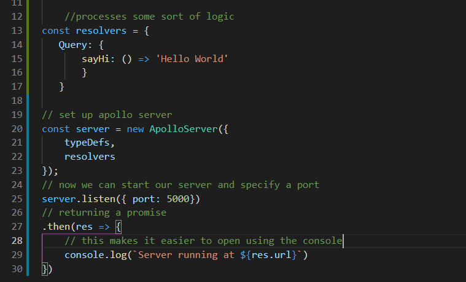
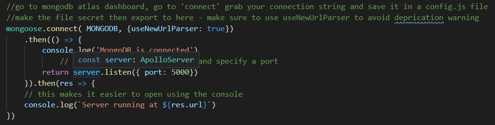
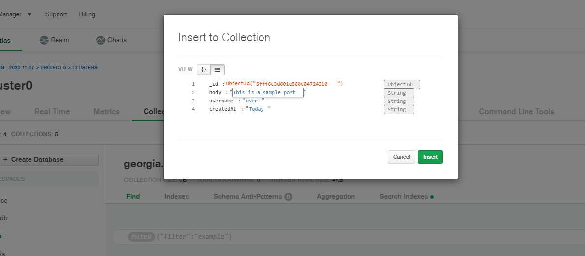
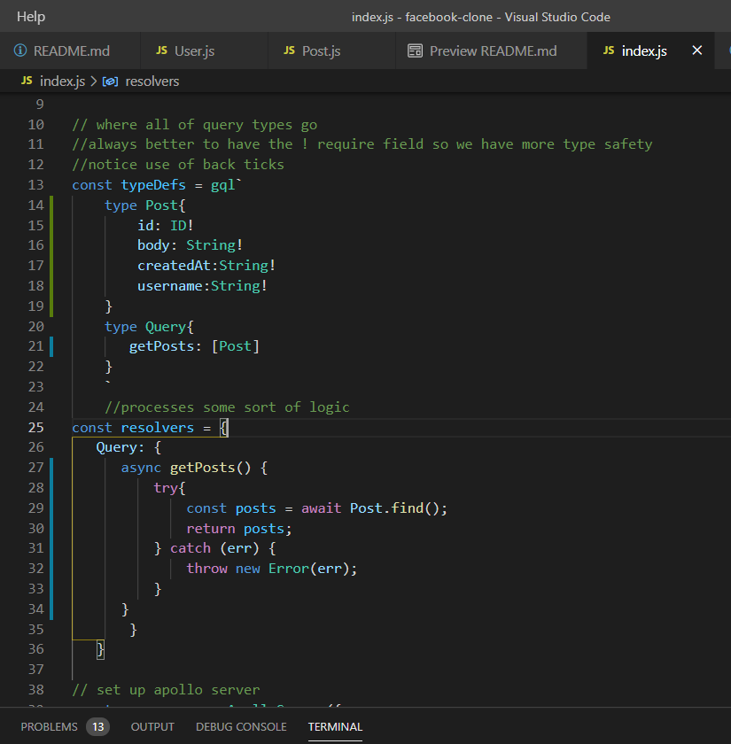
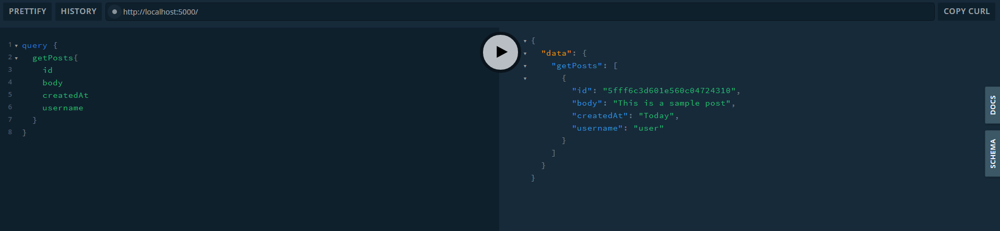

# facebook-clone
building a Facebook clone (kind of )

Technologies Used:
React - used to make responsive pages that "react" in real time to changes on the pages.
Semantic UI - Easy to use pre-built css framework that helps make building beautiful websites, easier.
GraphQL - A query language that can be used on top of any backend. There are 3 types of graphQl operations that we can perform: queries (fetching data), mutations(writing data creating, updating and deleting) and then subscriptions that listen to changes in data in real time.

Graph ql is self -documenting

Other: MongoDB (Atlas)
    Express
    Node.js

To start: 
0.1 Make sure you have a a cluster database set-up in the mongodb cloud website.
1. In the terminal, npm init -y -this should create a package.json
2. you will need to create a index.js and a .gitignore
3. Install dependencies: npm install apollo-server graphql mongoose
4. require ApolloServer and grahpql-tag in index.js  -in order to get syntax highlighting for graphql it's a good idea to install GraphQL for VSCode made by Kumar Harsh. 

5. Create typeDefs

6. set up resolvers, which will take in the graphql logic.
7. set up new apollo server. 
8. start a server and specify a port

9. Type in node index to see your progress! :) Press play to see your database working
10. Require mongoose, our ORM library. in the index.js next to where gql and apollo server are working
11. The connect using mongoose by going to mongodb atlas dashboard, go to 'connect' grab your connection string 
- creat config.js file and make a module.exports = { with your connection string here} and then make sure to gitignore your config file so one can see your password

mongodb+srv://rkelm:<password>@cluster0.o9vz6.mongodb.net/<dbname>?retryWrites=true&w=majority
12. rebuild index.js so it connects the localhost AND the database

13. Create models folders - create user.js model, post.js model
14. create a  query for fetching all the posts from the database - use a dummy post to check your work in the mongdb collections section - make sure you have one called "posts"

15. Adust query and resolvers to try to get posts, using try so that if it doesn't work, the entire server won't crash

...if you opne it up in local host and make sure your left side looks like this and hit play you should get something like this:

16. Clean up folders/files by creating graphql folder that holds the typedefs and a resolvers folder which containes two seperate files for resolvers (for users and posts) -also include that in the index - you can now remove const Post = require('./models/Post') from the index.js and replace it with const resolvers = require('./graphql/resolvers')